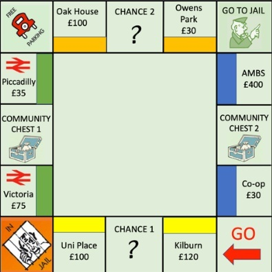
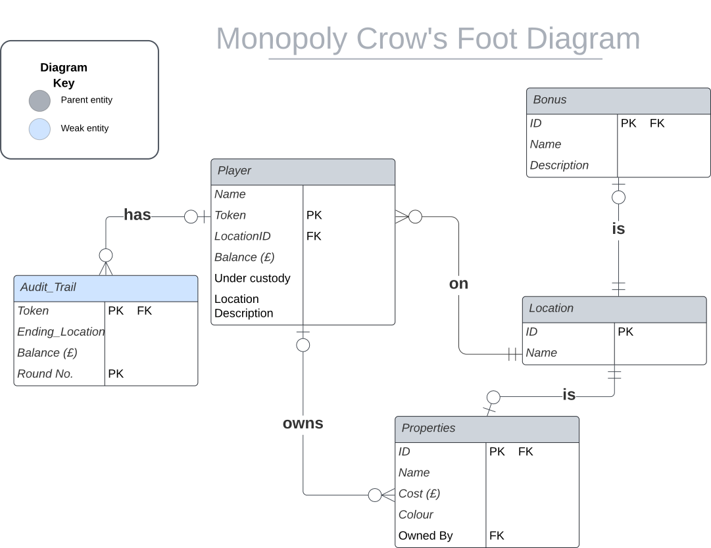

# Monopoly-Simulation

This project aims to simulate a Monopoly tournament using SQL. The board the game uses is based on Manchester, United Kingdom, which is shown below. The game has 4 players: Jane, Norman, Mary, and Bill. It uses a 6-sided die to make moves, and each square has different **landing effects**:

  

- **Go**: All players start the game from here. Passing or landing on this square gives £200.
- **Properties**: All squares with a price and colour are property squares. By landing on these squares, the player will purchase the property if it is unowned and they have enough money. Afterwards, other players will need to pay the price shown on the square when they land. If a player owns all properties of a particular colour, rent is doubled.
- **Community Chests**: Players landing here will either get £100 (e.g., beauty contest win), or pay £30 (e.g., overdue library books).
- **Chances**: Players landing here will either pay £50 to each player or move forward 3 spaces.
- **Free Parking**: Nothing happens.
- **Jail**: Nothing happens.
- **Go to Jail**: Players landing here are sent to the Jail square and can only be released by rolling a 6.

## Data Schema

The design of the relational database is shown by the Crow's Foot diagram below, which highlights the relationships between tables and the keys each table has. It is in **second normal form**, where all attributes are dependent on the primary key of their respective table, improving data integrity by eliminating partial dependencies between columns.

  

### Relationships between tables:

- `Location` and `Bonus`:  
  One-to-one — each location may have a bonus.

- `Location` and `Player`:  
  One-to-many — each player is at one location.

- `Location` and `Properties`:  
  One-to-one — not every location is a property, but every property must reference a location.

- `Player` and `Properties`:  
  One-to-many — a player may own many properties; a property may be unowned.

- `Player` and `Audit_Trail`:  
  One-to-many — players have multiple audit records during the game.

## Moves Update and Game Logic

Some defaults and triggers are implemented in the database to automate core game logic based on square effects:

- **Player's Starting State**:  
  All players start at the "Go" square (`LocationID = 0`) with £1500 in their balance.

- **Jail Mechanic**:  
  When a player lands on "Go to Jail", they are moved to the jail square and marked as under custody. They can only be released by rolling a 6.

- **Passing or Landing on "Go"**:  
  Adds £200 to the player's balance every time they pass or land on "Go".

- **Landing on a Property**:  
  Automatically deducts the purchase price or rent from the player's balance. If the player owns all properties of that colour, rent is doubled.

- **Audit Trail**:  
  Auto-fills with current round, balance, and ending location whenever a player's status is updated.

- **Location Description Update**:  
  Updates the `Location Description` field in the `Player` table based on the player's current `LocationID`.

## How to Run

To run the database and start simulation, here are all the files and queries within the **queries** folder:

1.**start_game**:
  - *create.sql*: Set up the database schema in MySQL and define all triggers.
  - *populate.sql*: Insert all informations for a game simulation for all tables to start the game.

2.**game_state**:
  - *view.sql*: This creates a view table displaying the current player performance in the game, including whether they bankrupted.

3.**game_moves**:
  - This folder contains 8 total game moves (*q1* ~ *q8*) for the players Jane, Norman, Mary, and Bill in 2 rounds, this is used to cross-check the accuracy of the game logic and updates implemented.

## Future Works

- **Chance and Community Chest Automation:**  
  Triggers will be implemented to simulate effects when landing on these squares. Examples include random monetary gains/losses or moving spaces forward.

- **Token Table for Higher Normalization:**  
  A dedicated `Token` table may be introduced to separate tokens from player identity, improving normalization and enhancing data integrity.

- **Web Interface for Online Gameplay:**  
  Once backend automation is complete, a web-based interface may be developed. This would allow users to interact with a visual board, perform game actions, and monitor the state of the game in real time.
